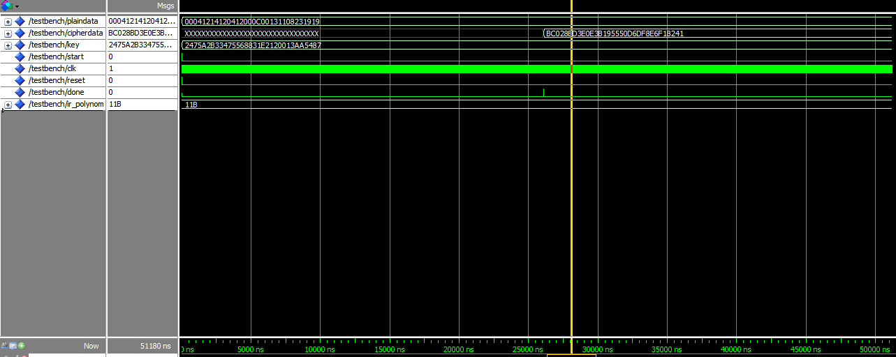

# VHDL Implementation of AES-128

## Background 
The National Institute of Science and Technology has selected block cipher called RIJNDAEL as
the symmetric key encryption algorithm. The AES algorithm can encrypt and decrypt information.
Encryption converts data to an unintelligible form which is called as cipher-text. Decryption of
cipher-text converts the data back to original form, called plain-text. The AES algorithm is capable
of using keys of 128, 192 and 256 bits to encrypt and decrypt the data in blocks of 128 bits.

  ### Some Highlights
  * Implemented world’s most and widespread securing cryptographic technique using VHDL.
  * Implemented 128-bit AES on DE0-nano FPGA having CYCLON IV-E family using SDRAM and PLL’s
  * Developed a flexible hardware implementation for all possible irreducible polynomial over (GF(2^8))
  * Verified results of AES design on FPGA through simplified version of standard JTAG (scan-chain)
  using PTX-128(microcontroller ATxMEGA128)
  
  ### Implementation
  VHDL is used as the hardware description language because of the flexibility and ease to exchange
  among enviroments. The software for this implementation is Altera Quartus Prime 16.0. This
  is used for writing, designing, debugging and optimizing efforts for timing analysis. Also used
  for fitting, assembling, simulating and checking the results using the simulation tools available on
  Quartus Prime.  
  
  All results are based on simulations from Cyclon IV E and Quartus tools using Gate Level
  Simulation. All the individual transformation of encryption and decryption are simulated using
  FPGA CYCLON IV E family and EP4CE22F17 device.
  
 <ig> Gate-level simulations with Altera Quartus Prime 16.0</ig>
 

  
